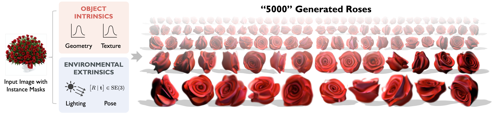
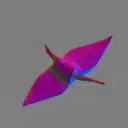

# Seeing a Rose in Five Thousand Ways


[arXiv](https://arxiv.org/abs/2212.04965) | [Project Page](https://ai.stanford.edu/~yzzhang/projects/rose/)

[Yunzhi Zhang](https://cs.stanford.edu/~yzzhang), [Shangzhe Wu](https://elliottwu.com/), [Noah Snavely](https://www.cs.cornell.edu/~snavely/), [Jiajun Wu](https://jiajunwu.com/). CVPR 2023.



## Install Dependencies
Create a conda environment:
```
conda create -n objint python=3.9
conda activate objint
```
Install pytorch based on your CUDA version:
```
conda install pytorch torchvision pytorch-cuda=11.7 -c pytorch -c nvidia
```
Install other dependencies manually:
```
pip install omegaconf tensorboard scipy opencv-python matplotlib imageio[ffmpeg]
```

[//]: # (Or create an environment with the provided `.yml`:)

[//]: # (```)

[//]: # (conda env create -f environment.yml)

[//]: # (```)

## Training

Launch single-GPU training with:
```bash
python scripts/train.py -d data/example
```
or distributed training with:
```bash
torchrun --standalone --nnodes=1 --nproc_per_node=YOUR_NUM_GPUS scripts/train.py -d data/green_crane
```

Checkpoints and tensorboard files will be saved under `logs/_data_example`. 

## Inference
```bash
python scripts/test.py -p YOUR_EXP_DIR
```
Append `--force-update` if you want to recompute the results.

After 100k iterations, which takes around 12 hours on 2 GeForce RTX 3090 GPUs, you should be able to see the following results after running `python scripts/test.py -p logs/_data_example -depth 16`:

<table>
  <tr>
    <td></td>
    <td></td>
    <td></td>
    <td></td>
  </tr>
</table>


## Acknowledgement
Some code is borrowed from [NeUS](https://github.com/Totoro97/NeuS), [StyleSDF](https://github.com/royorel/StyleSDF), [GIRAFFE](https://github.com/autonomousvision/giraffe), and [StyleGAN2-ADA](https://github.com/NVlabs/stylegan2-ada-pytorch). Thanks for their amazing works! 

## Citation
If you find this work useful, please cite our paper:
```
@InProceedings{zhang2023rose,
  author    = {Yunzhi Zhang and Shangzhe Wu and Noah Snavely and Jiajun Wu},
  title     = {Seeing a Rose in Five Thousand Ways},
  booktitle = {CVPR},
  year      = {2023}
}
```
